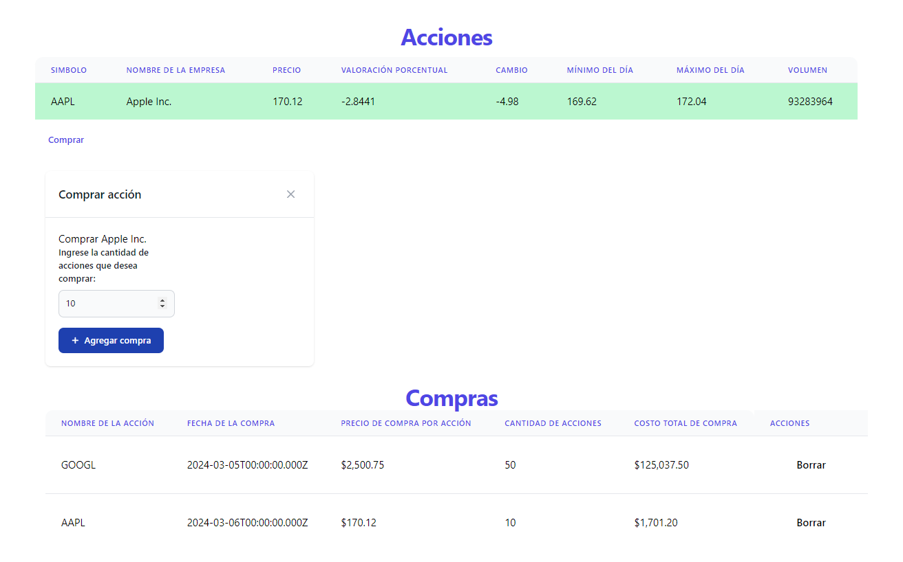
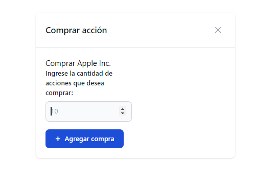
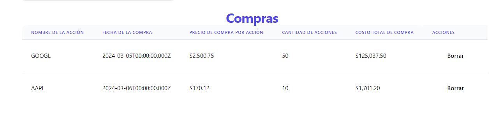

# Documentación de Pruebas de Funcionalidad - Aplicación Web de Registro de Compras de Acciones

## Caso de Prueba 1: Registro Exitoso de Compra de Acciones

### Descripción
Se verifica que la aplicación registra correctamente la compra de acciones al proporcionar la información necesaria.

### Pasos
1. Ingresar al sistema.
2. Navegar a la sección de compra de acciones.
3. Seleccionar de la tabla la acción que se va a comprar.
4. Se despliega un modal donde se indica las acción seleccionada y se completa el formulario con la siguiente información
   - **Cantidad de Acciones:** [Cantidad de Acciones]
5. Enviar el formulario.

### Resultado Esperado
- La aplicación debe calcular automáticamente el costo total de la compra.
- Se debe visualizar la información registrada en una tabla que incluya las columnas siguientes:
  - NOMBRE DE LA ACCIÓN | FECHA DE LA COMPRA | PRECIO DE COMPRA POR ACCIÓN | CANTIDAD DE ACCIONES | COSTO TOTAL DE COMPRA
### Resultado Obtenido

### Estado de la prueba: aprobado

## Caso de Prueba 2: Validación de Campos Obligatorios

### Descripción
Se verifica que la aplicación muestra mensajes de error o impide la acción si no se proporciona el campo como es solicitado

### Pasos
1. Ingresar al sistema.
2. Navegar a la sección de compra de acciones.
3. Seleccionar de la tabla la acción que se va a comprar.
4. Se despliega un modal donde se indica las acción seleccionada y se completa el formulario con la siguiente información
   - **Cantidad de Acciones:** hola
5. Intentar enviar el formulario con campos no válidos.

### Resultado Esperado
- No se debe permitir enviar el formulario hasta que se completen todos los campos obligatorios.

### Resultado Obtenido 

### Estado de la prueba: Aprobado
## Caso de Prueba 3: Borrar registro
### Descripción
Se verifica que la aplicación realiza correctamente el cálculo automático del costo total de la compra.

### Pasos
1. Ingresar al sistema.
2. Navegar a la sección de registro de compras de acciones.
3. Seleccionar la accion "Borrar" de cualquier registro.

### Resultado Esperado
- Después de seleccionar "Borrar" el registro debe desaparecer de la tabla de compras.
  
### Ejecución
 
### Resultado Obtenido

### Estado de la prueba: aprobado