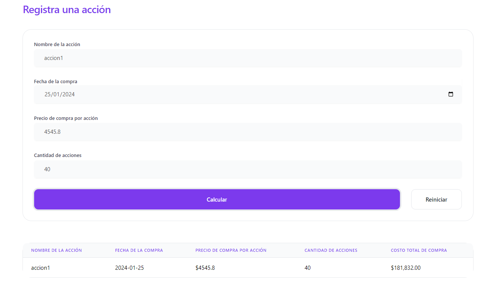
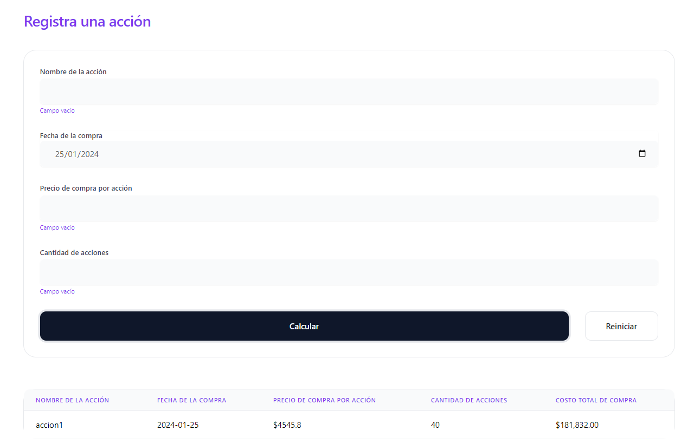
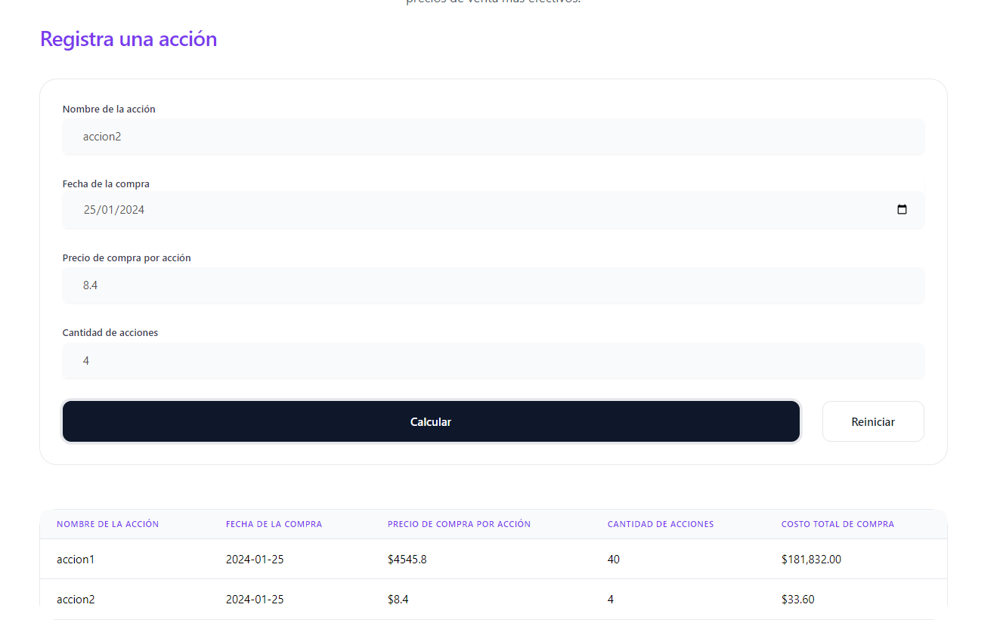

# Documentación de Pruebas de Funcionalidad - Aplicación Web de Registro de Compras de Acciones

## Caso de Prueba 1: Registro Exitoso de Compra de Acciones

### Descripción
Se verifica que la aplicación registra correctamente la compra de acciones al proporcionar la información necesaria.

### Pasos
1. Ingresar al sistema.
2. Navegar a la sección de registro de compra de acciones.
3. Completar el formulario con la siguiente información:
   - **Nombre de la Acción:** [Nombre de la Acción]
   - **Fecha de Compra:** [Fecha de Compra]
   - **Precio de Compra por Acción:** [Precio de Compra por Acción]
   - **Cantidad de Acciones:** [Cantidad de Acciones]
4. Enviar el formulario.

### Resultado Esperado
- La aplicación debe calcular automáticamente el costo total de la compra.
- Se debe visualizar la información registrada en una tabla que incluya las columnas siguientes:
  - NOMBRE DE LA ACCIÓN | FECHA DE LA COMPRA | PRECIO DE COMPRA POR ACCIÓN | CANTIDAD DE ACCIONES | COSTO TOTAL DE COMPRA
### Resultado Obtenido

### Estado de la prueba: aprobado

## Caso de Prueba 2: Validación de Campos Obligatorios

### Descripción
Se verifica que la aplicación muestra mensajes de error o impide la acción si no se proporcionan todos los campos obligatorios.

### Pasos
1. Ingresar al sistema.
2. Navegar a la sección de registro de compra de acciones.
3. Intentar enviar el formulario con campos obligatorios sin completar.

### Resultado Esperado
- La aplicación debe mostrar mensajes de error indicando los campos obligatorios que faltan.
- No se debe permitir enviar el formulario hasta que se completen todos los campos obligatorios.

### Resultado Obtenido 

### Estado de la prueba: aprobado
## Caso de Prueba 3: Cálculo Automático del Costo Total de Compra

### Descripción
Se verifica que la aplicación realiza correctamente el cálculo automático del costo total de la compra.

### Pasos
1. Ingresar al sistema.
2. Navegar a la sección de registro de compra de acciones.
3. Completar el formulario con información válida.

### Resultado Esperado
- Después de enviar el formulario, la aplicación debe calcular automáticamente el costo total de la compra y mostrarlo en la tabla.

### Resultado Obtenido

### Estado de la prueba: aprobado